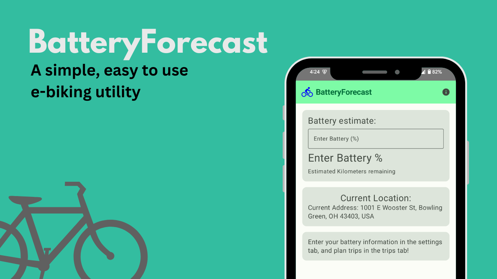

<h1> BatteryForecast </h1>
<h3> A simple, easy to use e-biking utility app

<h2> Team BatteryForecast: </h2>

**Created for CS3180 under the supervision of Dr. Green, by...**

**Noah Glaze**
- Some prior experience with mobile app dev and UI

**Ben Petterborg**
- Legacy code modernization
- git & GitLab

**Layne Woodruff**
- Some Java, and C++ from courses.

<h2> What is BatteryForecast? </h2>

BatteryForecast is a mobile app that lets you get information about your e-bike's battery at a glance.
To begin, go to settings and enter your battery's capacity in Amp-Hours, and your expected distance per Ah in kilometers.
Now, you can get an estimate on the distance you can travel with a given battery percentage by entering your current
percentage on the home screen. The **trips** page lets you enter a destination in, and save it for later.
For each destination, you can easily know how far away it is from you, and how much battery percentage it will take to get there.

<h2> Building and running BatteryForecast:</h2>

If you have *Android Studio* installed, building the app is easy. Download the source code, and open it in Android Studio. Connect a device over wi-fi or USB, or set up the built-in emulator. then, press the **run** button.

For more information, visit https://developer.android.com/studio/run

<h2> What we've learned </h2>

Making this app took the collective effort of three undergraduates over the course of a semester. Here's what we each learned during the process:

**Noah Glaze:**

While I had some prior app design knowledge, this project was my first introduction to state-based app design, and I learned a great deal on how to set up apps in this way, using Jetpack Compose.
I also learned how to store persistent data and handle user permissions (for location in this case), both of which were new to me.
This app also gave me the chance to deepen my skills of team-based development and real-world software development cycles.
Overall, the project has given me both confidence in my ability to produce useful software, and the realization that I have a long way to go before I will truly master app development.

**Ben Petterborg:**

Though my prior experience is solely in c++, Fortran, and Linux, this project was a great introduction to mobile app and frontend development. Although I was unable to fully implement weather API access in the final revision for this milestone, it is planned for the future.
Building this app also tested my skills with Git--we encountered some difficulties that I had not experienced before, giving me the opportunity to learn new troubleshooting techniques.
As we were jointly directing the project I had the opportunity to gain a small amount of experience managing scope and goals through the development lifecycle, as well.

**Layne Woodruff:**

Everything apart from the web functionality. There was a lot to cram into the app that we learned about from the class. I know I'm not a huge fan of Jetpack Compose due to all of the issues I had, but logcat is pretty good it saved me a few times. I'm still not completely confident in the syntax of kotlin and have to look things up all the time when putting the pieces together but I have a much better understanding than when I started the semester. The idea of state in coding wasn't completely new (due to dealing with listeners before) but I think the practice here really helped solidify that understanding and having more seperation (ex when dealing with the Dao vs Database). From what I understand now it'll help me with some of development for next semester for the capstone. I am significantly better with Git now, which is also a huge plus since I had worked with it before but not enough to know the ins and outs of branches and popping the stash etc etc. I'm pretty happy that I've picked that up as well.
